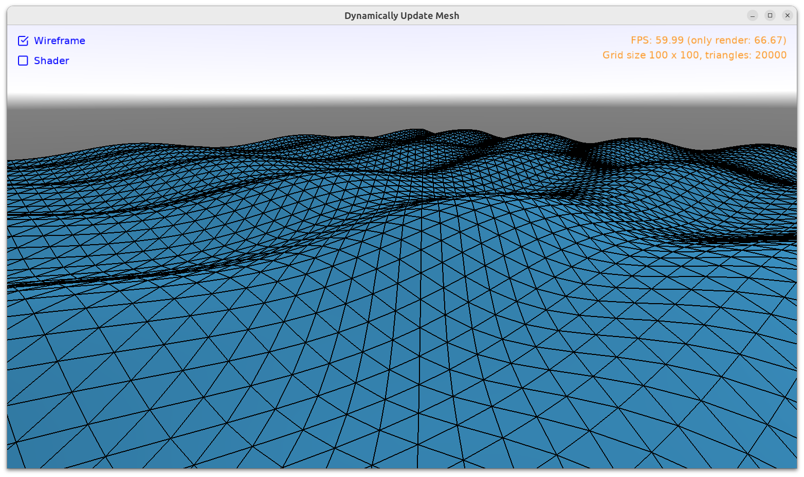

# Dynamically Update Mesh

This example demonstrates how to dynamically (as often as possible, to reflect e.g. time passing by) update the mesh of a 3D object, while still being efficient. There are 2 approaches:

1. Call `TCoordinateNode.SetPoint` as often as you want, e.g. from view's `Update` method.

    In this example, every `TViewMain.Update` increases `Time` and then calls `TViewMain.UpdateCoordinateNode`. The `TViewMain.UpdateCoordinateNode` updates the coordinates of the 3D object, the `Time` affects the waves shape.

    The point here is that `TCoordinateNode.SetPoint` is very efficient. It only updates the necessary rendering resource (VBO contents in OpenGL) and doesn't do any unnecessary work (doesn't rebuild anything, doesn't recreate any resource from scratch).

2. Use shaders. You can use our [shader effects](https://castle-engine.io/compositing_shaders.php) to add a _vertex shader_ that changes the position of each vertex right when it's supposed to be displayed.

    The advantage is that this is *even faster* because the Pascal code does almost nothing -- we just pass the new `Time` value to the shader. The per-vertex calculation is done by GPU, and GPUs are ridiculously fast at this.

    On one test system:

    - The first approach (TCoordinateNode.SetPoint) was able to handle 100 x 100 grid with 60 FPS. But once grid size increased to 200 x 200 it dropped to 18 FPS (in debug) or 38 FPS (in release).

      Note that changing the height calculation (to avoid `Sin` in Pascal) does not significantly change these measurements. The `Sin`, and in general how the `H` is calculated in Pascal, is not a bottleneck.

    - And the shader approach could handle 1000 x 1000 grid with 60 FPS. At 2000 x 2000 grid it dropped to 20 FPS. So, it's 100x more performant, if you look at the number of triangles it can handle while still maintaining 60 FPS!

      Note that changing the height calculation (to avoid `sin` in GLSL) does not significantly change this. Neither does _debug_ vs _release_ build (which makes sense, since the speed of Pascal code cannot be the bottleneck here).

    Note: For stress-testing, consider setting initial `CheckboxShader.Checked` in design to `true`, to start with more performing version immediately.

    The disadvantage is that _Castle Game Engine_ is not aware of the calculated vertex positions (they remain only on GPU). So e.g. any raycasts or other collision queries will treat this mesh as if it was in the original position (flat plane in this example).

    An additional potential disadvantage is that you need to learn _shading language_, more specifically [OpenGL Shading Language (GLSL)](https://www.khronos.org/opengl/wiki/OpenGL_Shading_Language). There's a small piece of GLSL code in `data/animate_mesh.vs`.

I encourage you to experiment with this example and try to stress-test it. It should handle very large values of `GridWidth` and `GridHeight`.

Using [Castle Game Engine](https://castle-engine.io/).

## Building

Compile by:

- [CGE editor](https://castle-engine.io/editor). Just use menu items _"Compile"_ or _"Compile And Run"_.

- Or use [CGE command-line build tool](https://castle-engine.io/build_tool). Run `castle-engine compile` in this directory.

- Or use [Lazarus](https://www.lazarus-ide.org/). Open in Lazarus `mesh_update_standalone.lpi` file and compile / run from Lazarus. Make sure to first register [CGE Lazarus packages](https://castle-engine.io/lazarus).

- Or use [Delphi](https://www.embarcadero.com/products/Delphi). Open in Delphi `mesh_update_standalone.dproj` file and compile / run from Delphi. See [CGE and Delphi](https://castle-engine.io/delphi) documentation for details.