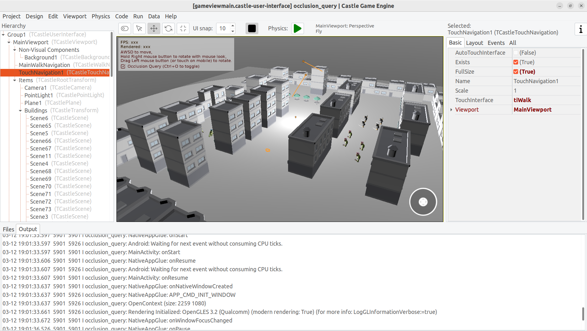
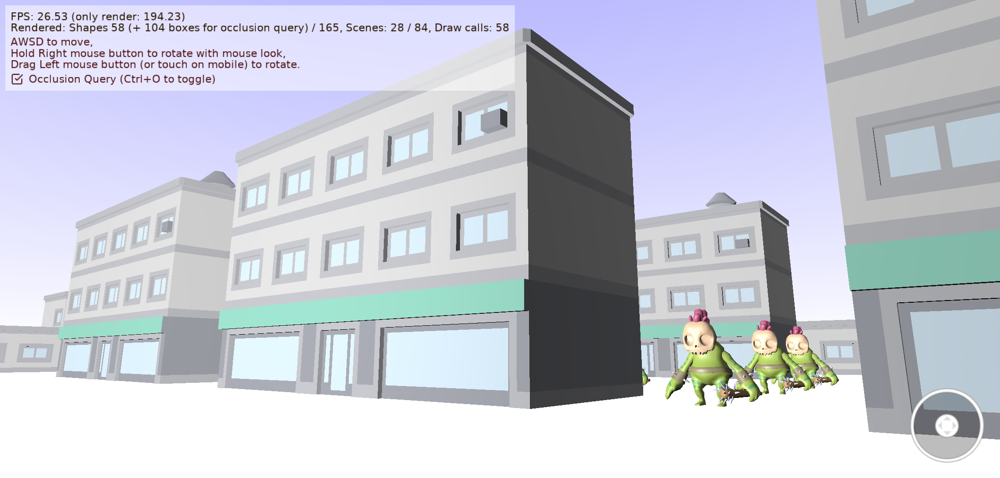

# Occlusion Culling Demo

Demo of occlusion culling: https://castle-engine.io/occlusion_culling .

Just move around and notice in status that when occlusion culling is _on_, we can eliminate most shapes from being displayed, instead we draw a trivial _"occlusion query box"_ just to detect their visibility next frame.

Note that controls of this demo are deliberately useful also on mobile (drag on screen to rotate, use the walk control in bottom-right corner to move).

Using [Castle Game Engine](https://castle-engine.io/).

## Building

Compile by:

- [CGE editor](https://castle-engine.io/manual_editor.php). Just use menu item _"Compile"_.

- Or use [CGE command-line build tool](https://castle-engine.io/build_tool). Run `castle-engine compile` in this directory.

- Or use [Lazarus](https://www.lazarus-ide.org/). Open in Lazarus `occlusion_culling_standalone.lpi` file and compile / run from Lazarus. Make sure to first register [CGE Lazarus packages](https://castle-engine.io/documentation.php).
