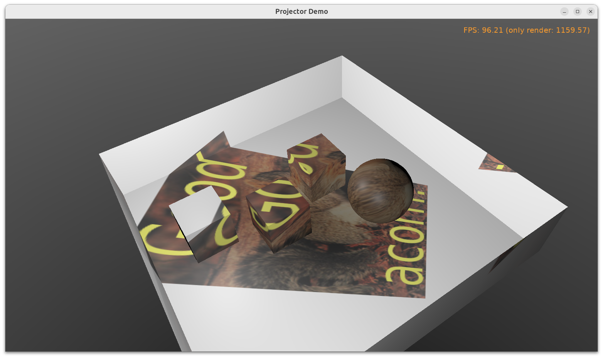

# Projector

Creating a projector that "casts" a texture at a complicated 3D shape.

This example uses [X3D nodes](https://castle-engine.io/vrml_x3d.php). Nodes used:

- Node `TProjectedTextureCoordinateNode` defines texture coordinates to cast a texture on a 3D shape. The projector created this way allows to cast a texture along the direction of some (maybe "fake", i.e. used only to cast texture) light or viewpoint.

    More information about `ProjectedTextureCoordinate` [is in the manual about shadow maps and projective texturing](https://castle-engine.io/x3d_extensions_shadow_maps.php).

- Light `TSpotLightNode` defines projector location/direction and size (light's `cutOffAngle` determines cast texture size).

The file `data/projective_texturing_simple.x3dv` in this project shows how to use these nodes -- you can double-click it to open in view3dscene, you can edit it in any text editor.

The example Pascal code adds these nodes to a glTF file exported from Blender.

The `Projector` location, direction and other properties can change at runtime freely, e.g. projector could rotate.

Note that example makes some assumptions, like:

- You have 1 projected texture.
- The mesh is initially not textured.

To overcome these limitations, you'd have to complicate adding the texture and texture coordinates: previous nodes have to be converted to lists (`TMultiTextureNode`, `TMultiTextureCoordinateNode`) to accomodate old and new textures. If this is unclear, [just ask on our forum or Discord](https://castle-engine.io/talk.php).

Using [Castle Game Engine](https://castle-engine.io/).

## Building

Compile by:

- [CGE editor](https://castle-engine.io/manual_editor.php). Just use menu item _"Compile"_.

- Or use [CGE command-line build tool](https://castle-engine.io/build_tool). Run `castle-engine compile` in this directory.

- Or use [Lazarus](https://www.lazarus-ide.org/). Open in Lazarus `projector_standalone.lpi` file and compile / run from Lazarus. Make sure to first register [CGE Lazarus packages](https://castle-engine.io/documentation.php).
