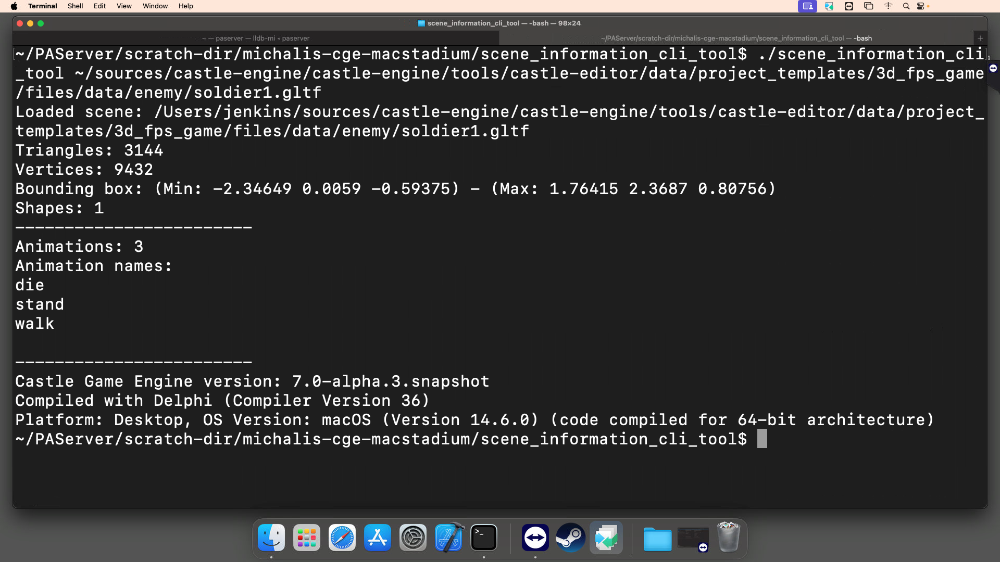

# Command-line utility to process model (scene) files

Command-line application to load and output various model information.

- Can process any [model format supported by CGE](https://castle-engine.io/creating_data_model_formats.php).

- Shows that our API, including `TCastleScene`, can be used without rendering too.

Usage: Provide the model filename as a parameter. If omitted we will load a simple test model.

## See also command-line Castle Model Converter

If you're looking for a tool to convert model files, see [Castle Model Converter](https://castle-engine.io/castle-model-converter). Source code [here](https://github.com/castle-engine/castle-model-viewer/blob/master/castle_model_converter.dpr). This is another application using our engine to do command-line scene processing.

Using [Castle Game Engine](https://castle-engine.io/).

## Building

Compile by:

- [CGE editor](https://castle-engine.io/editor). Just use menu items _"Compile"_ or _"Compile And Run"_.

- Or use [CGE command-line build tool](https://castle-engine.io/build_tool). Run `castle-engine compile` in this directory.

- Or use [Lazarus](https://www.lazarus-ide.org/). Open in Lazarus `build_3d_object_by_code_standalone.lpi` file and compile / run from Lazarus. Make sure to first register [CGE Lazarus packages](https://castle-engine.io/lazarus).
