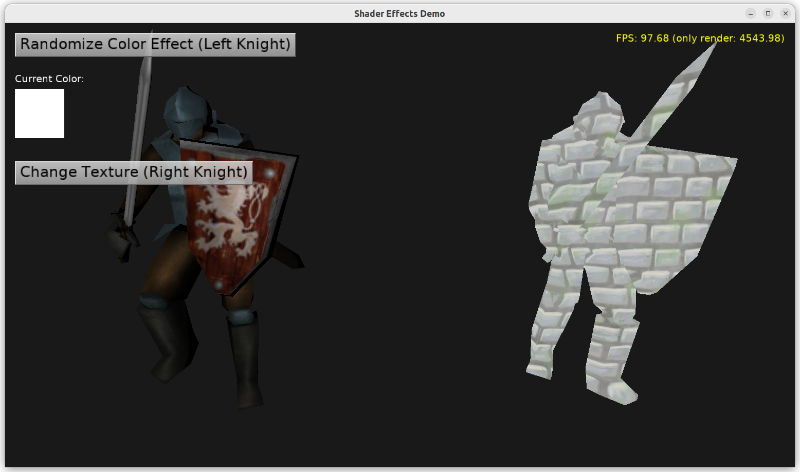

# Using Shader Effects to implement rendering effects that enhance the standard rendering

Demo of using _Castle Game Engine_ "shader effects" described on https://castle-engine.io/compositing_shaders.php from Pascal.

The demo adds an `Effect` node by code, and also shows how to manipulate custom `Effect` parameter (which maps to GLSL uniform) at runtime. These effects use shader code (GLSL, running on GPU) that is automatically integrated with standard engine rendering shaders.

We show 2 versions:

- custom color parameter

- custom texture parameter

In both cases, these are custom fields passed to `Effect` node, and they correspond to GLSL uniform variable.

See https://castle-engine.io/compositing_shaders.php and in particular https://castle-engine.io/compositing_shaders_doc/html/ about shader effects.

Using [Castle Game Engine](https://castle-engine.io/).

## Building

Compile by:

- [CGE editor](https://castle-engine.io/manual_editor.php). Just use menu item _"Compile"_.

- Or use [CGE command-line build tool](https://castle-engine.io/build_tool). Run `castle-engine compile` in this directory.

- Or use [Lazarus](https://www.lazarus-ide.org/). Open in Lazarus `shader_effects_standalone.lpi` file and compile / run from Lazarus. Make sure to first register [CGE Lazarus packages](https://castle-engine.io/documentation.php).
