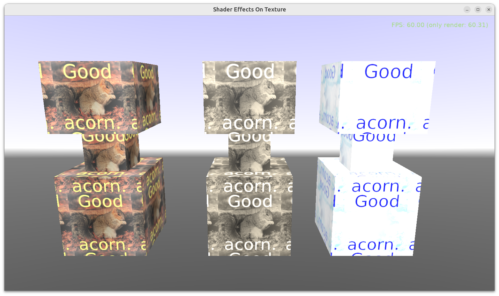

# Shader Effects On Texture

Example demonstrating how to apply shader effects on a texture.

## Screenshot

## What are shader effects?

_Shader effects_ are a technique in _Castle Game Engine_ to add a shader code (using GLSL, _OpenGL Shading Language_) to something, to modify its appearance. The shader code defines a special function `PLUG_xxx` which is then called from the engine to apply the effect.

For more information about shader effects see:

- https://castle-engine.io/compositing_shaders.php
- https://castle-engine.io/compositing_shaders_doc/html/
- and the important example [examples/viewport_and_scenes/shader_effects](https://github.com/castle-engine/castle-engine/tree/master/examples/viewport_and_scenes/shader_effects).

## What are shader effects on texture? What features do they have?

This example focuses on a special kind of _"shader effect"_ that you can add to a texture node in _Castle Game Engine_. Such effect changes the effective texture RGBA (color, opacity) used by the engine. You can process colors (and alpha) coming from a texture using a shader, to implement any idea that goes like _"I wish this texture would look like this"_. For example you can

- tweak texture colors,

- perform any texture transformation,

- mix the texture with anything (like blend with another texture, or display an animated effect over the texture),

- calculate some channel based on others (e.g. <a href="https://forum.castle-engine.io/t/image-black-edge-blending/1245/10">calculate alpha based on intensity of RGB colors</a>).

At the core, you just write a shader using GLSL that defines a function with magic name `PLUG_texture_color`, so it's really simple to start with some 1-line snippet, but you can explode it to do any crazy effect that GPU can handle :) See `data/shaders/` in this example.

The interesting Pascal code of this example is rather simple and limited to the `GameViewMain` unit (see `code/gameviewmain.pas`). It comes down to processing the scene, finding textures ([TAbstractSingleTextureNode](https://castle-engine.io/apidoc/html/X3DNodes.TAbstractSingleTextureNode.html) instances), and adding the effects. You can add any effect to any texture in any scene. The possibilities for tweaking this to your needs are vast:

- You can apply the effect to any scene / scenes.

- You can apply the effect to any textures there.

    To detect which texture is which, you have a number of options:

    - inspect [TAbstractTexture2DNode.TextureUsedFullUrl](https://castle-engine.io/apidoc/html/X3DNodes.TAbstractTexture2DNode.html#TextureUsedFullUrl) once the texture is loaded (set [TAbstractTexture2DNode.IsTextureLoaded](https://castle-engine.io/apidoc/html/X3DNodes.TAbstractTexture2DNode.html#IsTextureLoaded) to `true`to force loading it now),

    - inspect [TImageTextureNode.FdUrl](https://castle-engine.io/apidoc/html/X3DNodes.TImageTextureNode.html#FdUrl) to look at specified possible URLs of the texture,

    - as you can see there are a few useful texture classes involved, take a look at [TImageTextureNode](https://castle-engine.io/apidoc/html/X3DNodes.TImageTextureNode.html) and all its ancestors for all the goodies.

- You can add multiple effects to a single texture node, this is not a problem. The `PLUG_texture_color` function name is "magic", as mentioned before -- multiple effects on the same texture can use it. The engine will internally transform it into a working shader code (renaming the functions called `PLUG_texture_color` to something unique, and calling them from full shape rendering code).

- If you would like to ignore the original color read from texture image, sure -> you can. See at the shader code in `data/shaders/` and note that `PLUG_texture_color` function can just set the `texture_color` parameter to anything you want -- completely ignoring its previous value.

    We also have a dedicated [TShaderTextureNode](https://castle-engine.io/apidoc/html/X3DNodes.TShaderTextureNode.html) class (not demonstrated in this example), which is a special texture class that _does not_ read its contents from any image, and it's great if you would like to just "invent" texture contents, procedurally generating it in the shader, based on anything -- like a noise equation. [TShaderTextureNode](https://castle-engine.io/apidoc/html/X3DNodes.TShaderTextureNode.html) is great to define something that is a regular texture for all engine functionality (e.g. can get texture coordinates), yet it's completely "invented" by the shader code.

## Building

Using [Castle Game Engine](https://castle-engine.io/).

Compile by:

- [CGE editor](https://castle-engine.io/editor). Just use menu items _"Compile"_ or _"Compile And Run"_.

- Or use [CGE command-line build tool](https://castle-engine.io/build_tool). Run `castle-engine compile` in this directory.

- Or use [Lazarus](https://www.lazarus-ide.org/). Open in Lazarus `shader_effects_on_texture_standalone.lpi` file and compile / run from Lazarus. Make sure to first register [CGE Lazarus packages](https://castle-engine.io/lazarus).

- Or use [Delphi](https://www.embarcadero.com/products/Delphi). Open in Delphi `shader_effects_on_texture_standalone.dproj` file and compile / run from Delphi. See [CGE and Delphi](https://castle-engine.io/delphi) documentation for details.