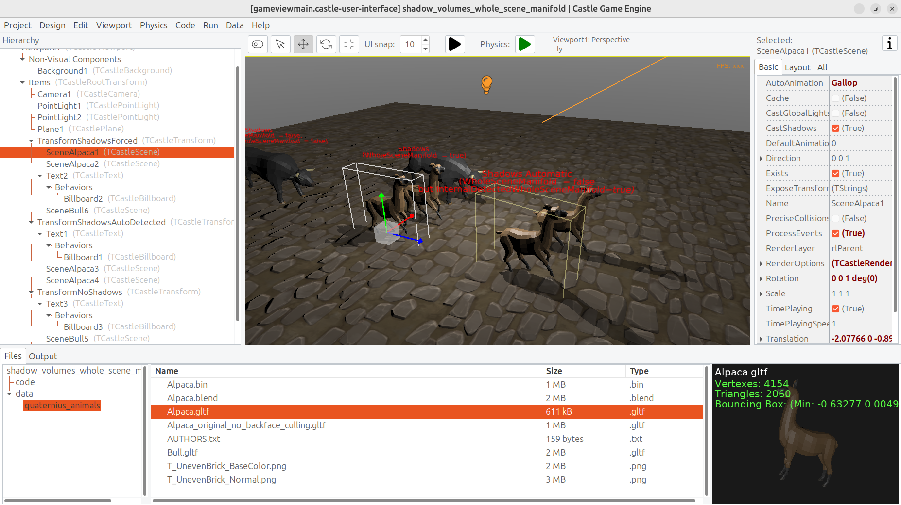

# Test RenderOptions.WholeSceneManifold

The example uses an Alpaca model that is *not* a single 2-manifold mesh, therefore by default it doesn't qualify as shadow volumes shadow caster. See https://castle-engine.io/shadow_volumes about 2-manifold requirement.

However, this model actually is 2-manifold if you look at the scene as a whole. All shapes (all meshes) together form a 2-manifold, i.e. a tight skin, because different meshes just represent a different material. You can confirm it by trying to select _"Non Manifold"_ in Blender -- it will select nothing, the model is manifold for Blender (before it is broken into separate meshes for each material).

Using `RenderOptions.WholeSceneManifold` allows to tell CGE to use this model as shadow caster with shadow volumes.

Note: We use a version of Alpaca model with _"Backface Culling"_ = _On_. Since 2-manifold scenes require consistent face ordering and "closed skin", using _"Backface Culling"_ on them is an obvious performance benefit. That said, the shadow volumes algorithm would also work if backface culling is off (you can test it by using `Alpaca_original_no_backface_culling.gltf` from our data), just rendering then wouldn't be optimal.

Using [Castle Game Engine](https://castle-engine.io/).

## Building

Compile by:

- [CGE editor](https://castle-engine.io/manual_editor.php). Just use menu item _"Compile"_.

- Or use [CGE command-line build tool](https://castle-engine.io/build_tool). Run `castle-engine compile` in this directory.

- Or use [Lazarus](https://www.lazarus-ide.org/). Open in Lazarus `shadow_volumes_whole_scene_manifold_standalone.lpi` file and compile / run from Lazarus. Make sure to first register [CGE Lazarus packages](https://castle-engine.io/documentation.php).
