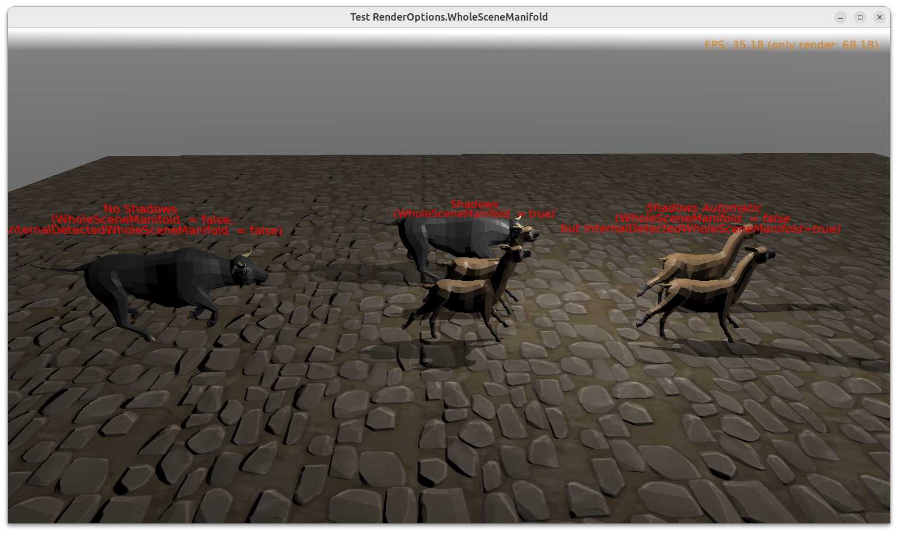

# Test detecting scene as 2-manifold, and forcing treating scene as 2-manifold

For [shadow volumes](https://castle-engine.io/shadow_volumes), everything that casts shadows must be 2-manifold.

- The engine can automatically detect when each _shape_ is 2-manifold.

    Note: _Shape_ in _Castle Game Engine_ means [X3D](https://castle-engine.io/x3d) `Shape` node, which is equal to [glTF](https://castle-engine.io/gltf) _primitive_, which is generally equal to a subset of [Blender object](https://castle-engine.io/blender) that has a single material.

- The engine can also automatically detect when some shape(s) are not 2-manifold, but the _whole scene_ is 2-manifold. This is a common case when you have a 2-manifold mesh in Blender, but it uses multiple materials. In such case, exporting it to glTF or X3D splits each mesh into multiple shapes. Each shape is _not_ 2-manifold but whole scene is.

- Even if none of the above applies, you can force treating the whole scene as 2-manifold. This is done by setting `RenderOptions.WholeSceneManifold` to `true`.

This example shows:

- _Alpaca_ model, that is detected as _whole scene is 2-manifold_.

- _Bull_ model, that is not detected as _whole scene is 2-manifold_. It really is not 2-manifold (horns are not "closed") but we can ignore this, and force treating the whole scene as 2-manifold, and it happens to work correctly with shadow volumes.

Note: We use a version of Alpaca model with _"Backface Culling"_ = _On_. Since 2-manifold scenes require consistent face ordering and "closed skin", using _"Backface Culling"_ on them is an obvious performance benefit. That said, the shadow volumes algorithm would also work if backface culling is off (you can test it by using `Alpaca_original_no_backface_culling.gltf` from our data), just rendering then wouldn't be optimal.

Using [Castle Game Engine](https://castle-engine.io/).

## Building

Compile by:

- [CGE editor](https://castle-engine.io/editor). Just use menu items _"Compile"_ or _"Compile And Run"_.

- Or use [CGE command-line build tool](https://castle-engine.io/build_tool). Run `castle-engine compile` in this directory.

- Or use [Lazarus](https://www.lazarus-ide.org/). Open in Lazarus `shadow_volumes_whole_scene_manifold_standalone.lpi` file and compile / run from Lazarus. Make sure to first register [CGE Lazarus packages](https://castle-engine.io/lazarus).

- Or use [Delphi](https://www.embarcadero.com/products/Delphi). Open in Delphi `shadow_volumes_whole_scene_manifold_standalone.dproj` file and compile / run from Delphi. See [CGE and Delphi](https://castle-engine.io/delphi) documentation for details.
