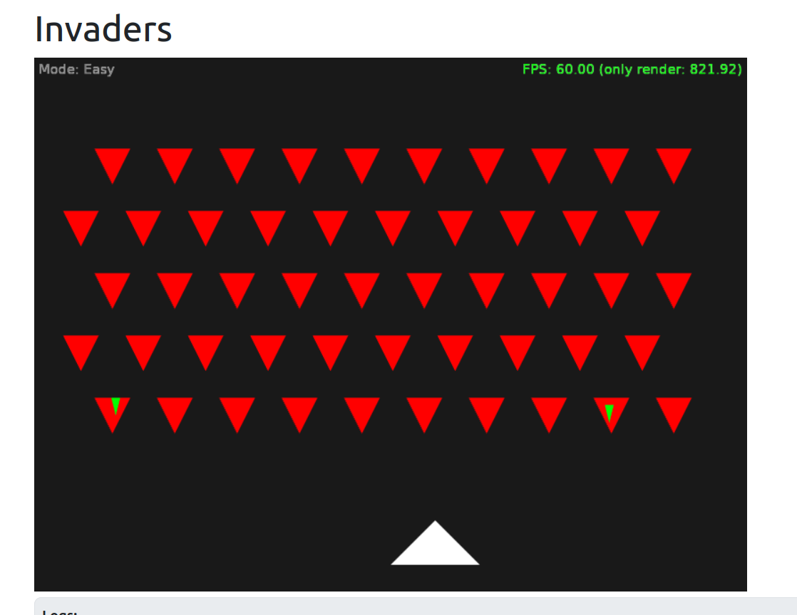

# Invaders

Simple "Invaders" 2D game.

This can be run on any platform, though was made specifically to test our [web](https://castle-engine.io/web) target.

We do not load anything from files here (which explains the simple look of this) because we didn't support `castle-data:/` when this was developed (it is supported now).

Note that drawing here doesn't account for any screen scaling. And we draw manually, drawing triangles. This is both more work, and less flexible, than our usual approach of drawing (using TCastleTransform inside TCastleViewport, or using TCastleUserInterface components). However, "manual drawing" fits current web platform constraints nicely (no loading from files, and we hardcode canvas size).

Using [Castle Game Engine](https://castle-engine.io/).

## Building

Compile by:

- [CGE editor](https://castle-engine.io/editor). Just use menu items _"Compile"_ or _"Compile And Run"_.

- Or use [CGE command-line build tool](https://castle-engine.io/build_tool). Run `castle-engine compile` in this directory.

- Or use [Lazarus](https://www.lazarus-ide.org/). Open in Lazarus `simplest_invaders_standalone.lpi` file and compile / run from Lazarus. Make sure to first register [CGE Lazarus packages](https://castle-engine.io/lazarus).

- Or use [Delphi](https://www.embarcadero.com/products/Delphi). Open in Delphi `simplest_invaders_standalone.dproj` file and compile / run from Delphi. See [CGE and Delphi](https://castle-engine.io/delphi) documentation for details.