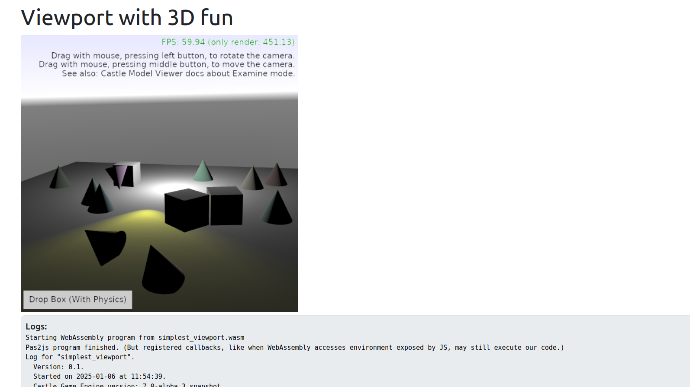

# Viewport with 3D fun

Test `TCastleViewport` with:
- 3D things like planes, cones, boxes.
- Lights, with animated spot light direction and shadows.
- Physics (boxes fall down with physics).

This can be run on any platform, though was made specifically to test our [web](https://castle-engine.io/web) target.

We do not load anything from files here (which explains the simple look of this) because we didn't support `castle-data:/` when this was developed (it is supported now).

Using [Castle Game Engine](https://castle-engine.io/).

## Building

Compile by:

- [CGE editor](https://castle-engine.io/editor). Just use menu items _"Compile"_ or _"Compile And Run"_.

- Or use [CGE command-line build tool](https://castle-engine.io/build_tool). Run `castle-engine compile` in this directory.

- Or use [Lazarus](https://www.lazarus-ide.org/). Open in Lazarus `simplest_viewport_standalone.lpi` file and compile / run from Lazarus. Make sure to first register [CGE Lazarus packages](https://castle-engine.io/lazarus).

- Or use [Delphi](https://www.embarcadero.com/products/Delphi). Open in Delphi `simplest_viewport_standalone.dproj` file and compile / run from Delphi. See [CGE and Delphi](https://castle-engine.io/delphi) documentation for details.