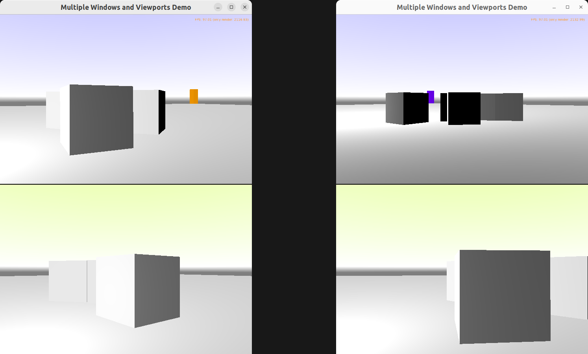

# Multiple Windows and Viewports Demo

Demo of using the same 3D world inside 4 viewports, in 2 windows (containers).

Technically this means that we have
- 1x TCastleRootTransform
- that is referenced by 4x instances of TCastleViewport, in TCastleViewport.Items
- we have 2x TCastleWindow.

    Each window corresponds to 1 TCastleContainer (so we have 2x TCastleContainer) in the application.

    Each window contains 2x TCastleViewport.

Walk using AWSD - and note that it affects the navigation in the viewport under mouse.

Drop physical box using Enter key.

Using [Castle Game Engine](https://castle-engine.io/).

## Building

Compile by:

- [CGE editor](https://castle-engine.io/editor). Just use menu items _"Compile"_ or _"Compile And Run"_.

- Or use [CGE command-line build tool](https://castle-engine.io/build_tool). Run `castle-engine compile` in this directory.

- Or use [Lazarus](https://www.lazarus-ide.org/). Open in Lazarus `multiple_windows_and_viewports_standalone.lpi` file and compile / run from Lazarus. Make sure to first register [CGE Lazarus packages](https://castle-engine.io/lazarus).

- Or use [Delphi](https://www.embarcadero.com/products/Delphi). Open in Delphi `multiple_windows_and_viewports_standalone.dproj` file and compile / run from Delphi. See [CGE and Delphi](https://castle-engine.io/delphi) documentation for details.
