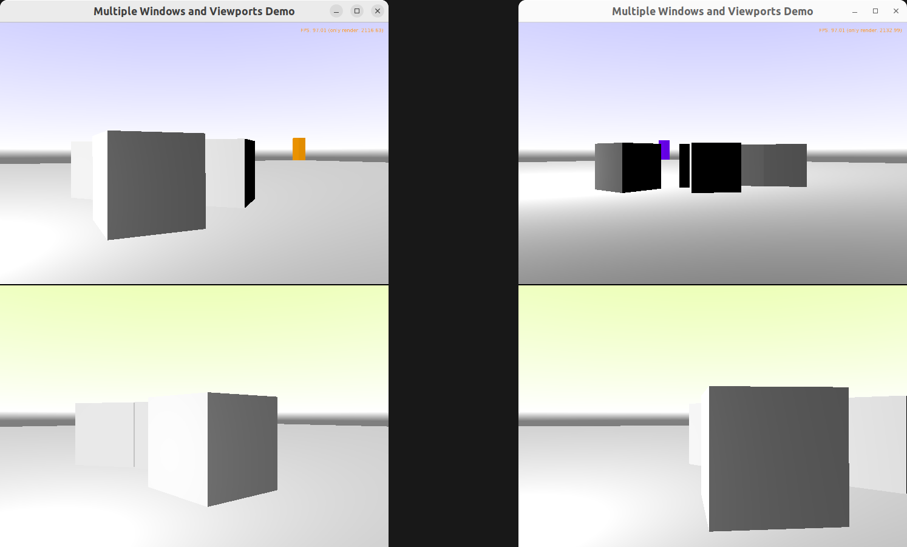

# Multiple Windows and Viewports Demo

Demo of using the same 3D world inside 4 viewports, in 2 windows (2 containers).

**Note this is quite non-standard setup. In usual applications, you have only 1 window, and 1 container, as this is sufficient and works cross-platform. Only desktop platforms allow multiple windows. And a single window can still contain multiple viewports (nice for e.g. split-screen games; simple games are fine with just 1 viewport).**

In this demo we have:

- 1x `TCastleRootTransform` (3D world shared by all viewports)

- The "one shared world" is referenced by 4x instances of `TCastleViewport`, by setting `TCastleViewport.Items` to the same value.

- We have 2x `TCastleWindow`.

    Each window corresponds to 1 `TCastleContainer` (so we have 2x `TCastleContainer`) in the application.

    Each window contains 2x `TCastleViewport`: top and bottom.

    Each viewport has its own camera, and it's own `TCastleWalkNavigation` (so you can move the camera in each viewport independently).

Navigation:

- Walk using AWSD. It affects the navigation in the viewport under mouse.

- Look around by moving the mouse while the right mouse button is pressed. Again, it affects the navigation in the viewport under mouse.

Drop physical box using _Enter_ key or _Left mouse button press_. This is useful to prove that indeed all 4 viewports share the same 3D world, and you can see the same box in all 4 viewports.

Using [Castle Game Engine](https://castle-engine.io/).

## Building

Compile by:

- [CGE editor](https://castle-engine.io/editor). Just use menu items _"Compile"_ or _"Compile And Run"_.

- Or use [CGE command-line build tool](https://castle-engine.io/build_tool). Run `castle-engine compile` in this directory.

- Or use [Lazarus](https://www.lazarus-ide.org/). Open in Lazarus `multiple_windows_and_viewports_standalone.lpi` file and compile / run from Lazarus. Make sure to first register [CGE Lazarus packages](https://castle-engine.io/lazarus).

- Or use [Delphi](https://www.embarcadero.com/products/Delphi). Open in Delphi `multiple_windows_and_viewports_standalone.dproj` file and compile / run from Delphi. See [CGE and Delphi](https://castle-engine.io/delphi) documentation for details.
