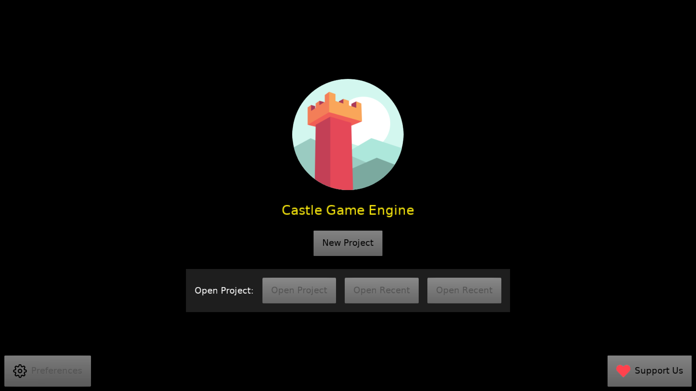

# Minimal and Portable version of Castle Game Engine Editor

**For now, this is only a proof of concept. This version of the editor is not functional for any real work at this point. Use the real editor, based on LCL, in `../castle-editor/`.**

This is a minimal "editor-like" application, featuring a subset of functionality of the [real Castle Game Engine editor](https://castle-engine.io/editor) but using our engine's [user interface components](https://castle-engine.io/user_interface) for 100% of the work.

Compared to the [real Castle Game Engine editor](https://castle-engine.io/editor):

- This is completely portable to all systems where CGE can run, e.g. also to mobile (Android, iOS), Nintendo Switch, web.

- This is portable to all compilers we support, so both Delphi and FPC.

- This looks the same on all platforms, and "dark mode" is trivial to implement here. Actually, we just do "dark mode" by default.

- However! A lot of important functionality is yet missing. See TODOs below. This is not a replacement for the real editor yet. But with time, it can be -- we can copy here more and more "real" editor's functionality, and eventually make this a fully-functional editor version.

Features:

- Create a new project, choosing one of the templates.
- Open an existing project (only from cross-platform writeable space, in `ApplicationConfig('my-projects/')`), or recent, or examples.
- Choosing and displaying a given view in the project.
- Displaying components hierarchy.
- Displaying object inspector (thus, viewing and editing components properties).

TODOs:

- Manipulating TCastleTransform.
- Adding new components to the view.
- Manipulating UI (extact functionality from castle-editor?).
- Creating new views.
- Build Project.
- Run Project.
- Run Physics Simulation.
- Our object inspector has a number of critical shortcomings, e.g. it can edit only boolean properties for now. The rest is read-only.
- Multi-selection.
- Bottom pane with Files of the project, preview, ability to drag-and-drop files to the design, double-click to open files.
- Bottom pane with Console output.
- UI scaling: right now editor uses UI scaling and just applies it to the loaded design. Instead: editor UI scaling should be configurable and the loaded design should be scaled following project's settings. Loaded design should also enable zoom and scroll, that's independent feature (and would be nice to have in the real editor too).
- Import/export project. And ability to just open projects at arbitrary location on platforms where regular filesystem exists (desktops).

Using [Castle Game Engine](https://castle-engine.io/).

## Building

Compile by:

- [CGE editor](https://castle-engine.io/editor). Just use menu items _"Compile"_ or _"Compile And Run"_.

- Or use [CGE command-line build tool](https://castle-engine.io/build_tool). Run `castle-engine compile` in this directory.

- Or use [Lazarus](https://www.lazarus-ide.org/). Open in Lazarus `castle_editor_portable_standalone.lpi` file and compile / run from Lazarus. Make sure to first register [CGE Lazarus packages](https://castle-engine.io/lazarus).

- Or use [Delphi](https://www.embarcadero.com/products/Delphi). Open in Delphi `castle_editor_portable_standalone.dproj` file and compile / run from Delphi. See [CGE and Delphi](https://castle-engine.io/delphi) documentation for details.

## License

Just like the real editor, based on LCL, in `../castle-editor/`:

This version of **Castle Game Engine Editor** is provided on the GNU GPL >= 2 license terms.
*Not* on more permissive terms of LGPL (with static linking exception) >= 2
(that are used for the rest of the Castle Game Engine).
See https://castle-engine.io/license for details.
This means that:

- You can use the editor to create your own closed-source programs,

- But you cannot fork the editor into a closed-source program (and distribute it publicly). If you want to fork, the fork has to be open-source as well, following GPL.

- You are of course free to extend Castle Game Engine editor for internal purposes (if you don't distribute it publicly, the GPL license terms don't concern you), or you can extend it publicly on terms of GPL (thus, keeping the whole work open-source).

When contributing (sending pull requests etc.) to the castle-editor-portable source code,
you agree that your contributions may be used under either GPL
or a more permissive "LGPL with static linking exception" terms,
at the discretion of _Castle Game Engine Developers_.
_Castle Game Engine Developers_ are defined as _people with write (commit) access
to the official CGE version control repository_
(referred to from https://castle-engine.io/ , currently
https://github.com/castle-engine/castle-engine/ ).
The idea is that we sometimes want to move code from castle-editor to
the engine core, for technical reasons, and we want the freedom to do so.
Still, the complete editor stays GPL, as we don't apply this dual license to all our editor code, and complete editor is only GPL.
